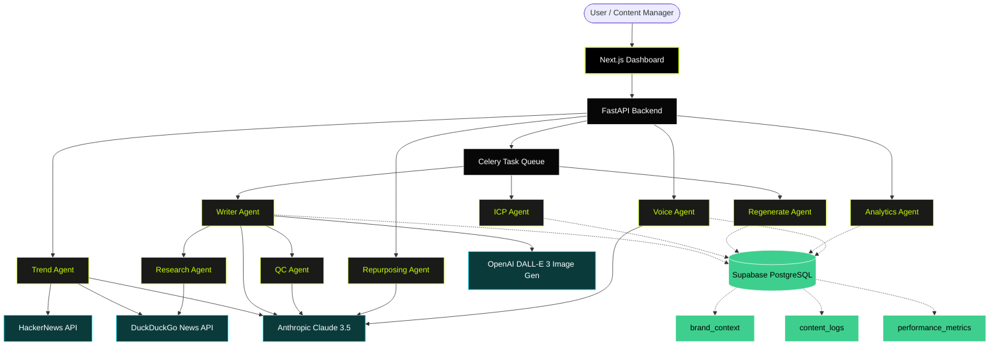

# Bitcot Content OS: Comprehensive Architecture & Workflow

## Overview

The **Bitcot Content OS** is an autonomous, multi-agent AI content generation factory designed strictly for B2B technology companies. Traditional "AI wrappers" act as simple text-expanders—taking a prompt and spitting out a generic blog post. The Bitcot Content OS acts as an **elite in-house ghostwriter and strategist**, leveraging a highly sophisticated, asynchronous pipeline to produce anti-fluff, highly technical content designed specifically for cynical software engineering buyers (CTOs, VPs of Engineering, Senior Developers, and Founders).

## Why Bitcot Content OS is Better than Standard AI Pipelines

Standard AI content generation pipelines typically suffer from the following fatal flaws:
1. **Generic, Fluffy Output:** They rely on basic prompts that output "thought leadership" fluff, easily spotted by technical audiences.
2. **Static Workflows:** They use linear templates (e.g., Intro -> Body -> Conclusion).
3. **No Native Verification:** They hallucinate facts and output unverified claims.
4. **Poor formatting and tone control:** They ignore brand voice.

**Bitcot Content OS solves this through a multi-agent orchestrated approach:**
* **Gatekeeping:** Before a word is written, the `ICPAgent` (Ideal Customer Profile Agent) forces the topic to prove its relevance. If it's too generic, it gets "reshaped" to fit an enterprise B2B angle.
* **Modular Strategy (EEAT & GEO):** It dynamically assembles content structures based on the persona. A post targeting a CTO gets an action framework; a post for developers gets code walkthroughs. It is also inherently designed for Google's Generative Engine Optimization (GEO).
* **Multi-Agent Quality Control:** A dedicated `QCAgent` debates the `WriterAgent` to refine tone, strip buzzwords, and ensure the brand voice is strictly maintained.
* **Factual Grounding:** A `ResearchAgent` autonomously browses the live web to fetch real product metrics, latest features, and historical facts, injecting them into the draft.
* **Competitor Radar:** The `TrendAgent` doesn't just look for what's trending. Feed it a competitor's URL, and it will intentionally generate a "counter-narrative" to differentiate your brand.

---

## Complete System Architecture Diagram

---

## Detailed Agent Workflow Breakdown

### 1. Discovery & Strategy (Mode A)
* **`TrendAgent`:** Autonomously scrapes HackerNews and DuckDuckGo for breaking software engineering news. 
* **Competitor Radar:** If a competitor's URL is provided, the `TrendAgent` scrapes the competitor's post and instructs Claude to generate contrarian, counter-narrative topics. It filters out any topic that peaked more than 6 months ago to ensure high recency.

### 2. The Gatekeeper (ICP Agent)
* **`ICPAgent`:** Evaluates the selected topic against the Bitcot Ideal Customer Profile (B2B tech buyers). If a topic scores below 0.6, the agent dynamically rewrites the topic to target an enterprise use case (e.g., turning "How to build a React app" into "The hidden scalability costs of React for Enterprise Dashboards").

### 3. Generation Engine (Writer & Research Agents)
* **`WriterAgent`:** The core workhorse. It pulls tone, persona, and brand guidelines from the Supabase database.
* **`ResearchAgent`:** Mid-flight, the Writer pauses to ask the ResearchAgent to verify claims or fetch live facts.
* **Omni-Channel Output:** The Writer simultaneously outputs an SEO-optimized Blog, a Twitter (X) thread, and an A/B tested set of 3 LinkedIn hooks.
* **Image Generation:** Integrates with DALL-E 3 for highly detailed, relevant graphic generations based on the article's context.

### 4. Quality Control & Refinement (QC Agent)
* **`QCAgent`:** Acts as a strict editorial layer. Before the user ever sees the draft, the QCAgent reviews it against the specified tone. It surgically removes generic AI fluff (e.g., "In today's fast-paced digital landscape...") and returns a critique flag alongside a revised draft.

### 5. Content Repurposing (Repurposing Agent - Mode C)
* **`RepurposingAgent`:** Can take any existing long-form content (like an external URL, a YouTube transcript, or an existing blog post) and intelligently extract the core thesis. It then slices the content into platform-native formats (e.g., 3 distinct LinkedIn angles and an X thread).

### 6. The Learning Loop (Analytics & Voice Agents)
* **`VoiceAgent`:** Analyzes custom writing samples provided by the user to reverse-engineer their exact voice, saving the custom instructions to the database for future content generation.
* **`AnalyticsAgent`:** Can connect with social APIs (or accept manual metric inputs) to analyze which posts drove the most engagement, updating the `brand_context` table so the AI learns what hooks and formats actually perform well over time.

---

## The Tech Stack

* **Frontend:** Next.js 14, React, Tailwind CSS, TypeScript. A beautiful, dark-mode dashboard tailored for a premium user experience.
* **Backend:** FastAPI (Python) for ultra-fast async endpoints.
* **Background Jobs:** Celery and Redis to handle the asynchronous orchestration of LLM requests without blocking the UI.
* **LLM Core:** Anthropic Claude 3.5 (Sonnet/Opus) for high-reasoning tasks and long context windows, alongside OpenAI for DALL-E 3 image generation.
* **Database:** Supabase (PostgreSQL) for relational mapping of brand contexts, content generation logs, and performance data.
